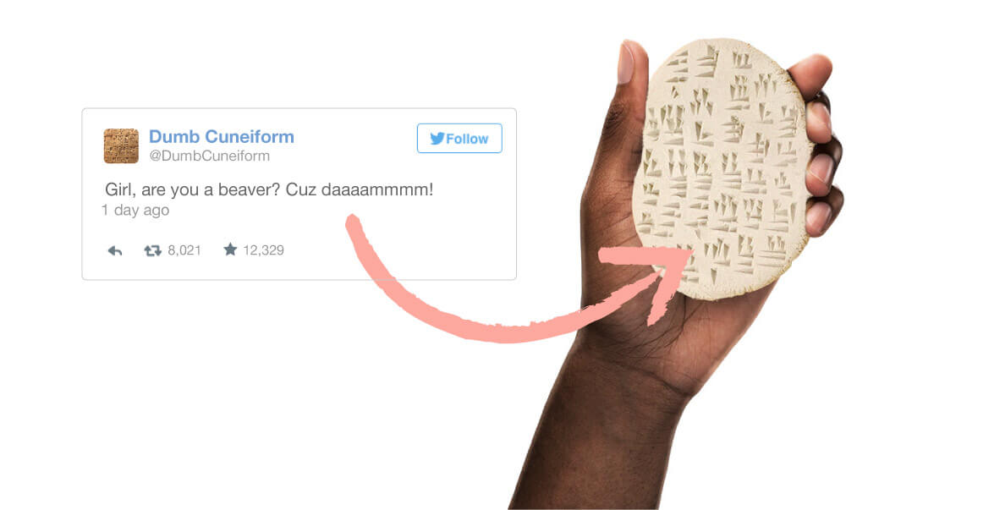

## Lost in translation

Language is a powerful tool for accurately and concisely *symbolising* and *sharing* ideas.

*Written* language extends the possible scope of it's utility *immeasurably*--temporally and spatially--and is perhaps the most important invention in all of human history.

Every language and alphabet can have wildly different *grammars*--patterns and structures of words and sentences--that must be followed, *to the letter*, to glean or convey anything meaningful from it.

"Car driving person" or "mouse chased cat", depending on the motifs of the grammar, can have implications *differing* from a self-driving car or a monstrous rodent.

### *So* sorry.

Often *tone* or *contextual purpose* is the primary factor when trying to understand what was *actually* being meant from any given message.

Formatting serves to modify, or ***color***, the underlying message through conventions for *emphasis* or **strength** on ***words*** to convey these various *implicit*--distinctly unique--concepts.

Hyper-Text Markup Language [(HTML)][^html] and Cascading Style Sheets ~~Language~~ (CSS)[^css] are the languages of the **content** and **formatting** and **functions** of the documents that *browsers* use to communicate with website *pages*.

HTML ***elements***--which are the *types* of sections of a page--and CSS ***properties***--like size or color--make up the *alphabet, punctuation, and formatting* of the *language of the internet*.

---
## *These boots are made for blockin'!*

Bootstrap is a **UI-framework**--sets of tools for commonly-built interactable pieces of programs--which offers a collection of frequently-combined HTML and CSS settings for various purposes.

Additionally the framework enables the different *elements* of a page to be dynamically sized, through javascript, based on the size of the screen or window that's displaying the page.

---
**References:**

[^html]: Hyper-Text Markup Language (HTML): *"the standard markup language for documents **designed to be displayed in a web browser**"* <https://en.wikipedia.org/wiki/HTML>

[^css]: Cascading Style Sheets (CSS): *"a style sheet language used for describing the **presentation** of a document written in a markup language"* <https://en.wikipedia.org/wiki/CSS>

---
