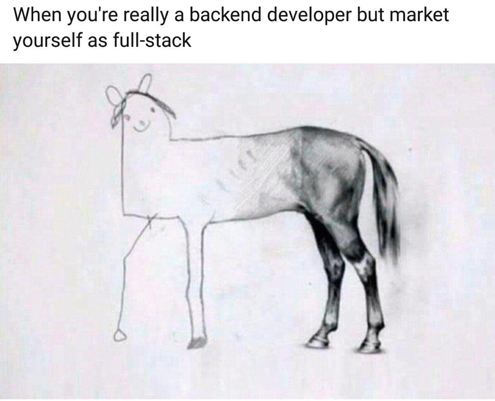

## Engineering an engineer
For those of us not acquainted with Arthurian legend, the holy grail--according to [Merriam-Webster](https://www.merriam-webster.com/dictionary/Holy%20Grail)--can be "an object or goal that is sought after for its great significance".  With respect to software engineering skills, the quest for the holy grail can be embodied in the pursuit to become a **full-stack** developer.  A full-stack developer is one who is capable of producing both the *front-end* and *back-end* of an application.

The **front-end** refers to that part of the app that the user would see and interact with, and is interchangeably referred to as the "client-side" in a website context.

The **back-end** refers to the parts that the user doesn't see, and is interchangeably referred to as the "server-side".

A developer can specialize in either, and it seems that many pursue at least a cursory understanding of both, but each person inevitably tends toward either one of them according to their strength or experience.

The holy grail more resembles a utopian ideal, even though it is *possible* to truly know both intimately, and can obfuscate the reality into something comical, illustrated hilariously by this meme.

Now, to call myself a back-end developer is too much of an overstatement--let alone a full-stack one--but, in my opinion, the ability to have something simple at the front is preferable to leaving it blank, even if it is wrong, as long as it works to complete the picture.  The quest goes on.

---
### The right tools for the job

Producing anything presents the obvious conundrums; what to do and how to go about it.  Rather than to design and build these abstract ideas up ourselves "from scratch" we learned how to use **Frameworks**.  These simply are sets of pre-made tools and resources that help us to accomplish the tasks of building either the front or back end--or in the case of some, both--of an application.

There are several options--in many programming languages--to choose from to suit several different types of applications but the ones we worked with were created to use javascript, through [Node.js](https://nodejs.org/en), and HTML with CSS to make webpages.

---
## _Framing_ the conversation

Frameworks are classified based on which part of the application it is relevant to; so there are front-end frameworks and back-end frameworks.

One such framework which concerns itself with the front end of webpages is called [**Bootstrap5**](https://getbootstrap.com/).  This is a UI-Framework consisting of HTML and CSS combinations, called "***classes***", that fulfill the common needs of portioning webpages, the coloring of text and backgrounds, and for displaying images.

On the other hand, [**MongoDB**](https://www.mongodb.com/) is a back-end framework which implements the **design pattern**--the general form that a commonly desired functionality takes--of structured data storage for client and server databases, and is written in many programming languages, but we used the one for javascript.

---
### Their powers combined

A third type of framework correlates to the combination of both the front and back end and is intuitively named a full-stack framework.  A powerful example of this is called [**React**](https://react.dev/) which combines HTML, CSS, and javascript, all into a new type of multi-lingual file which can save data as a normal javascript program while it interfaces with a user through a webpage.

Some full-stack frameworks can also be composed of other frameworks, combining the strengths of both; adding Bootstrap to React expands both into a new React-Bootstrap *composite* framework which allows easy Bootstrap styling through it's components with Reacts complex back-end functionality.

---
#### A hat on a hat

Some of these frameworks even come with **packages** which include more commonly implemented functionality; the [**Uniforms-bootstrap5**](https://uniforms.tools/) package, for example, satisfies the common need of many React-Bootstrap apps to retrieve information from *forms* on webpages and ensuring that that data is valid.

The solutions to this need tends to contain complex procedures that take the same general shape, and also an appropriately obscene amount of time to make, so they were generalized and gathered up and included into a package that many can use.  This need is so prevalent that uniforms supports frameworks other than Bootstrap.

For example, the boxes where you enter your payment information to make purchases online or that one that is ensuring you make your password 8 characters long are both a special type of component that may have come from Uniforms, or some other similar package.

---
#### To whom it may concern

The largest benefit of finding these composite frameworks with support for large amounts of packages is, of course, not having to do much of the work of making each of it's parts function together.

We refer to this type of monotonous writing as *boilerplate* code because of how the shape of it changes very little between different projects.

We see boilerplate all the time when we find we're using certain groups of words over and over again in the same way; as with writing the same "Happy New Years, Person-Y" or reprinting job resumes that change by one line each time you need to use it.

We tend to recognize that pattern and either obtain or produce a generic form that we can copy from and re-use, and some even profit from making them available, like the many greeting-card companies do with cards.

The kinder people of the community save these boilerplate files when they spot the pattern and provide them to the rest of us to use and improve on.  In programming, as in any document generation, we call these repeating forms of boilerplate as **Templates**.

---
## All the marbles

The amount of time saved from using templates becomes much more pronounced when dealing with projects with increasing numbers of packages, or when dealing with significantly differing packages; as would be the case when manually combining a full-stack framework from front and back end frameworks individually.

The most powerful frameworks, naturally, are those with the most powerful constituents, that all share common languages, and are implemented with their own package.  Finally, we come to [**Meteor**](https://guide.meteor.com/) which can be configured to combine React with MongoDB, bringing in a powerful and flexible front end framework with a powerful and flexible back end framework and connected through the common language of javascript.

Templates of [**Meteor-React**](https://guide.meteor.com/react.html) applications can get quite hefty and can contain large amounts of boilerplate to actually connect these frameworks together.  It also wouldn't be an understatement to say that you need encyclopedic knowledge of how each part works in order to know how things will interact.  It is, however, extremely powerful to work the entire project in a common set of languages, and in one place, and to have the flexibility of countless packages to support evolving functionality and efficiency while prototyping works-in-progress..

## 

---
