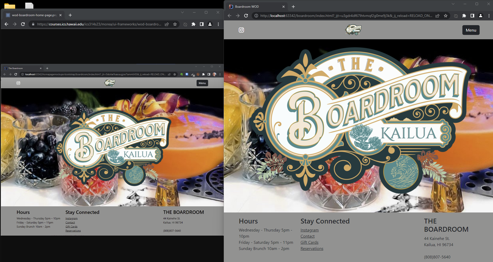

<body>

<h2>What is Bootstrap?</h2>

Bootstrap 5 is a package which allows the designer of a website to create dynamically sized and stylized web pages.  The package consists of a variety of template-settings for types of sections that are frequently found on pages, like the now-common navigation bars at the tops of pages or the drop-down menus and their associated buttons.  It also gives incredible support for common icons, like the triple line that represents most menu buttons or the icons for popular social media websites and applications that links you to either a specific profile associated with that website or to attach your own profile somehow to the website.

<h2>Why use Bootstrap?</h2>

The complexity of using Bootstrap is significant, because you need to know what data these templates require and how and when to give it to them and sometimes even how they interact with each other.  The long list of supported objects--called classes--makes it a daunting prospect to learn, and I've only shallowly interacted with it so far, but from what I've experienced it has been far easier to use <em>it</em> than to try to create these things myself; it invokes a satisfying not-"reinventing the wheel"-vibe when it actually all works out.  It is here where Bootstrap can really shine since merely overriding the default behavior of these classes, like coloring or sizing or text-fonts, enables the designer to create uniqueness or parity as desired without all that leg-work.

<h3></h3>

<h2>What do I think?</h2>

In the context of being under a time-constrained assignment--like for Workout-of-the-Day (WOD)--and considering my equally limited understanding of HTML and CSS, Bootstrap has enabled me a level of efficiency that I simply could not even imagine without it.  The excellent documentation, again as compared to those for HTML and CSS, provides working examples that simply takes all the pain out of the construction of the page and their elements.  I even learned a few things about plain HTML and CSS that I just wasn't understanding otherwise, by seeing how those tags and classes were used by Bootstrap, and feel like the whole experience gave me that invaluable insight into web pages that I had assumed I would get from learning HTML.

<h3>How do I feel?</h3>

Certainly, every single WOD related to HTML and CSS and Bootstrap has once again been a humbling experience, to say the least, and has <em>once again</em> made me painfully aware of the limits of my knowledge.  In reflection, although I had finished the homework assignments that were plain HTML and CSS, they were <em>very</em> simple pages and gave me a false sense of security so that when I wasn't able to finish the any of the bootstrap ones on-time I became worried and doubled my effort.

</body>