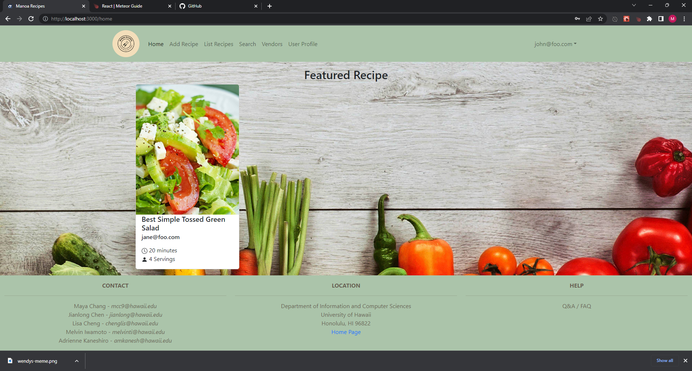
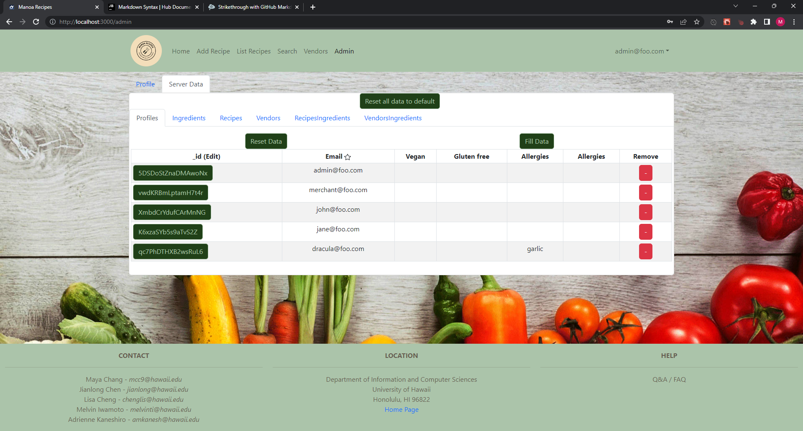

## Farm to table
There have been multitudes of dietary fads popping up and fading away for years but there is one thing that could never go out of style; meals made *yourself* from ingredients *you* chose.

The vast abundance of choices available and the relatively cheap prices of ready-to-eat meals, or *fast*-food, permeates every corner of our society.

This breeds and sustains a culture of consumerism that only serves to produce viciously competitive and unkind interactions between inanimate probably-evil corporate entities.

I was part of a group that developed an application in a project, called Manoa Recipes, whose noble purpose was to provide college students with a website where they could find and exchange cooking recipes.

---
## Manoa Recipes

The website is centered around the recipes, naturally, along where to find the ingredients for them and what the prices would be at locations near to the campus.

A lot of work went into the project and can be found in the [project page](https://manoa-recipes.github.io/) for the website, however, I will be focusing what I talk about around implementing the evolving administrator page and the initial data structures I designed the website to have.

### Getting off the ground

Establishing a simple page for the admin gave way to the realization that I wasn't able to make a list of data whose shapes don't yet exist; so I shifted to designing a tentative data structure to display.

I began by doing some research on recipes to distill all the information into separate pieces of data; each recipe has a name and a list of ingredients, and the template was easy to spot.

Each ingredient in a recipe has--at a minimum--an additional size and amount with the name of it, and, by design, were intended to include associated prices and locations of markets.

Ingredients linked every intended search of the websites database so the design of the different lists came naturally.

### Designing data
The lists were Recipes, Ingredients, Vendors, and Profiles with RecipesIngredients and VendorsIngredients linking their respective lists.

The amount of lists and data-points to keep track of became too unwieldy so I trimmed all data to only what was necessary to implement intended search functionalities.

    Vendor: {
        name: ...,
        address: ...
    }
    VendorIngredient: {
        address: ...,
        ingredient: ...,
        price: ...
    }
    etc...

Following the establishment of the data structures I created some default testing data and resumed building lists to display the server's new database to the admin.

### Growing pains
In the course of development we started to expand the data into their fuller forms so there came an increasing need for the database lists on the admin page to properly reflect the states of the data.

    Vendor: {
        name: ...,
        address: ...,
        image: ...,
        etc...
    }
    etc...

We were also required to provide a significant amount of data to test out the functionality of the website so there was an additional urgent need to manually refill the default testing data.

The increase in the size of the database also meant that the simple lists I created needed to take that in account, so I overkilled a solution for both.

### How to use a bullet to swat two flies

The original purpose of the data list on the admin page was to allow the admin to police the database but the original implementation only supported viewing the data.

Every list had been implemented separately but were all nearly identical so I began work on generalizing them all into a single list component.

Each generalized list accessed its own database and automatically displayed each list's different data accurately and only needed to know which database to display.

Additionally, each list could be cleared and refilled with data from the file containing the default data, and all lists could be cleared and refilled from the master button above the list tabs.

And finally implementing its initial intention, every entry could be either removed or edited through buttons each now possessed.

The functions behind the buttons are an entire story themselves but it is sufficient to say that they were also generalized to support the functionalities of the new lists.
