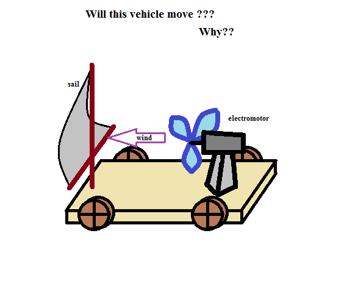
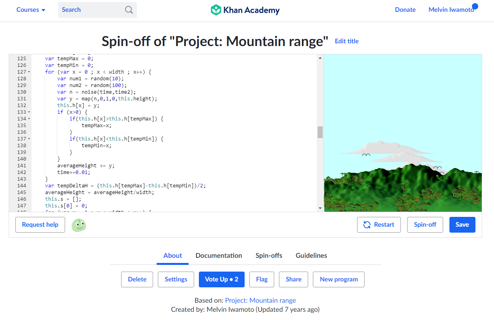

<head>
  <h1>Moving Mountains and Building Interest</h1>
</head>

<body>
  
  
  
  

  
  <h2>Opting out</h2>
  
  
After moving on from EE160 I had a deep interest in programming and the seeming ease with which one can create working programs whose complexities are limited only by the imagination.  The accessibility of it was also incredibly appealing; you could type into a simple text-editor, name the file with a specific extension, and produce programming code that could be compiled into a program.  Even writing pseudo-code on paper could help to at least organize your thoughts and you might be able to make progress on coding anywhere without even an electronic device.

  
  
The <em>only</em> experience with <em>any</em> programming language that I had, though, was in C-Language and that was through on using UH's UNIX server as an Integrated Development Environment (IDE) and I had had more than enough of interacting with that at the time.  The cumbersome effects of having to learn to press the keys j, k, l, and ';' to move the cursor around a document in the VIM was unappealing and felt backward and caused me a few headaches when using conventional applications like Microsoft Word.  I also had built up a yearning to interact with programming in a more graphically meaningful way beyond mere formatted text.

  
  
The ability to create the game Snake had sparked an interest toward creating more complex things and I intended to just learn it all on my own and alongside my original academic pursuit.  I wanted to learn a language that wasn't as archaic as C-Language and yet was also old enough that it was already being used to program new games; most importantly, however, was a language that was supported by a free and on-line IDE, possibly through a web-page, which allows normal typing and mouse support, rather than through a console, and that is how I came across Khan Academy and their computer science courses and JavaScript IDE.

  
  

  
  <h2>Khan Academy: Chasing the horizon</h2>
  
  
The computer science courses consist of modules that have small projects as a sort of capstone and I ended up completing them fairly quickly.  One such of these projects is to produce code that draws a mountain range onto an embeded canvas in the web-page next to the text-editting portion, as shown in the following screenshot.

  
  
  
  
Central to this lesson on simulation is the use of a noise function which generates fluctuating values, much like a normal random number generator (RNG), but it differs from a normal RNG by taking progressive inputs and generating number close to its previous one, so 

  
  https://www.khanacademy.org/computer-programming/spin-off-of-project-mountain-range/3255520902
  
</body>
