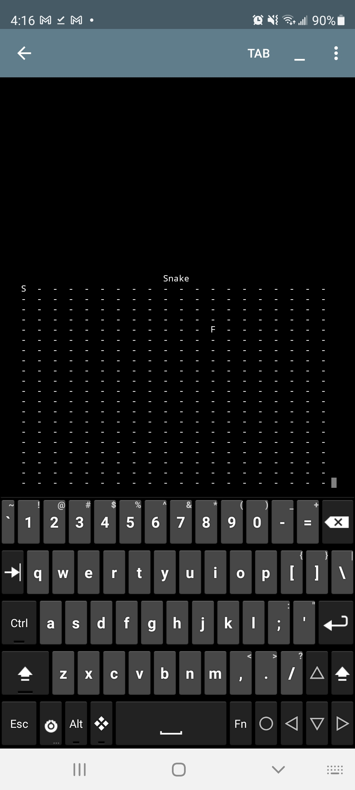

<head>
  <h1>Snake - Nokia Nostalgia</h1>
</head>

<body>
  
  
  
  <h2>What is Snake?</h2>
  
  
As mass production flooded the market with newly affordable mobile phones, not only with regard to the hardware but with the contracts for service as well, aquiring these phones became much more practical and prevalent for "middle-class" families.  In some cases, as time progressed in these market conditions, even children and young adults were gaining personal access and ownership of these devices.  The game "Snake" came pre-installed onto Nokia phones and it is by this way that I was introduced to the game and it was one of the only other functions of the phone, aside from talk and text, before the appearance of smart phones and the app stores they brought with them.

  
  <h2>How it works</h2>
  
  
The game is a simple untimed game that is played on a grid.  On that grid is a snake represented by a head with a direction on one space and the rest of the body and tail on trailing spaces which grows in length as the snake collects tokens, presumably representing mice.  The snake moves on its own and the player must direct the snake in such a way that it never crosses its own body, which causes the game to end, providing an increasing difficulty level as the game progresses.  The snake is also programmed to begin to move faster as it grows, thereby compounding the increasing difficulty.  The game is technically winnable with a maximum possible score if you can fill the entire grid play-area with your body.  Eventually the game was made to support a high-score list and was ultimately given a sequel-game with improved graphical representation of the grid, the tokens, and the snake.

  
  

  
  <h2>What the project was</h2>
  
  
In 2015, I was pursuing a degree in Civil Engineering and I ended up enrolling in the course Electrical Engineering 160 to fulfil a peripheral requirement for the Associates degree in Science offered from the University of Hawaii (UH): Kapi'olani Community College's (KCC's) STEM program.  This was the first time I had ever interacted with computer science or programming directly and it had sparked great interest in me by the end of it, despite having to learn the initially alien command-line UNIX system that UH uses and the <em>infuriatingly</em> difficult-to-use text editting program Visual Editor Improved (VIM).

  
  
As part of the final grade for that course we were required to write a Game Design Document (GDD) and implement the game from C Language.  After reviewing example programs that utilized a periodically refreshing grid layout, simulating animation, to display gameplay areas on a text-console I was reminded of the game snake and decided to pursue that for my submission.  The greatest appeal, of course, was that I'd be able to create the program simply from modifying the existing example programs, substantially reducing the time required to produce the project during the hectic period surrounding finals and holidays.

  
  
  
  <h2>The struggle to remember</h2>
  
   
  
  
The above is the console output of the actual code used in the submission of the project that was run on a modern mobile-phone Integrated Development Environment (IDE) app that supports c and c++ file compilation.  The source code itself was preserved on the UH UNIX system and I retrieved it before clearing my space on the server when I had to once again use that server and system for the course ICS212 several years later.  Unfortunately, the program requires ncurses, a library that supports refreshing the console output to provide a dynamically changing interface rather than the scrolling list of actions that normal console output, and I had forgotten how I installed it onto the UNIX server.  I resorted to the previously mentioned phone app because it supports ncurses but it does not support the file-linking procedure in <em>makefiles</em>, and moreover the code itself is quite rudimentary, and so is now throwing many errors that I simply don't currently have time to decipher; so my attempt to splice together the code from several files has yielded a broken game that can only display the grid area and the title of the game as a static image.

  
  
Although the picture may not show much it does show the playing area and the title of the game, along with the starting points for the head of the snake and the initial position of the token to collect, with the letters S and F respectively.  The token does move around every time it launches and fails to continue running, though.  What is not shown is that there should be a time and score and once the game plays the head of the snake is represented by the &lt, ^, &gt, and the lower-case 'v' to represent direction of travel, a star symbol * for each body segment, and a lower-case 'o' as the tail.  Had I been able to play it, the keys w, a, s, and d would point the snake in the corresponding relative directions.

  
  <h2>Reflection</h2>
  
  
What is also not shown is what I had learned doing it.  Perhaps now that I look at it the effort put forth was sorely lacking not only in its conception but also in its attempted rescue, but this image's significance is higher for me than simply as a reminder of a successful or exceptional grade or as merely the final project at the end of a peripheral engineering course.  Indeed, in hindsight, it also represents the beginning of my current path in computer science.  The memory of it had also helped me in choosing my direction after I abandoned my pursuit of an engineering degree.  This project is perhaps the most appropriate and significant work to showcase as it was the first program I wrote that I had any say in and invokes a peculiar sense of pride.

  
</body>
