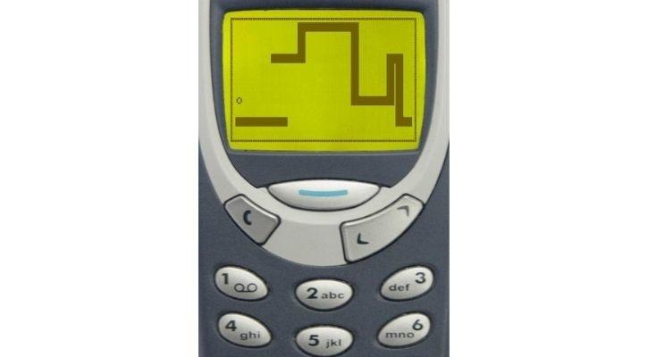

As mass production flooded the market with newly affordable mobile phones, not only with regard to the hardware but with the contracts for service as well, aquiring these phones became much more practical and prevalent for "middle-class" families.  In some cases, as time progressed in these market conditions, even children and young adults were gaining personal access and ownership of these devices.  The game "Snake" came pre-installed onto Nokia phones and it is by this way that I was introduced to the game.

The game is a simple untimed game that is played on a grid.  On that grid is a snake, represented by a head with a direction on one space and the rest of the body and tail on trailing spaces which grows in length as the snake collects tokens, presumably representing mice.  The snake moves on its own and the player must direct the snake in such a way that it never crosses its own body, which causes the game to end, providing an increasing difficulty level as the game progresses.  The snake is also programmed to begin to move faster as it grows, thereby compounding the increasing difficulty.  The game is technically winnable with a maximum possible score if you can fill the entire grid play-area with your body.  Eventually the game was made to support a high-score list and was ultimately given a sequel-game with improved graphical representation of the grid, the tokens, and the snake.

<pre>

In 2013, I was pursuing a degree in Civil Engineering and I ended up enrolling in the course Electrical Engineering 160 to fulfil a requirement for the Associates degree in Science offered from the University of Hawaii (UH): Kapi'olani Community College's (KCC's) STEM program.  This was the first time I had ever interacted with computer science or programming and it sparked great interest in me despite having to learn the command-line UNIX system that UH uses and the infuriatingly hard-to-use text editting program Visual Editor Improved (VIM).

As part of the final grade for that course we were required to write a Game Design Document (GDD) and implement the game from C Language.

</pre>

Source: <a href="https://github.com/jogarces/ics-313-text-game"><i class="large github icon "></i>jogarces/ics-313-text-game</a>
