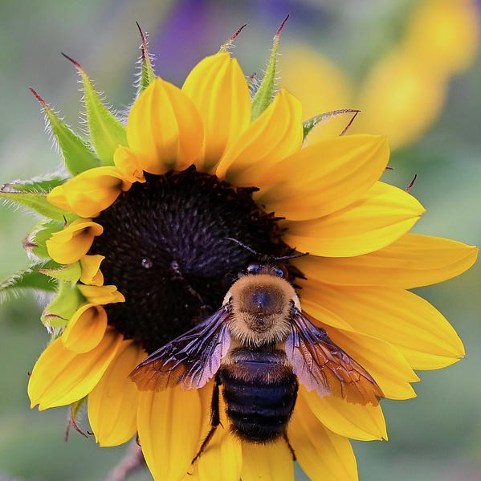

<body>
<h1>Minding my own beeswax</h1>

  

<h2></h2>
  

  

  

  

  
<h2></h2>
  

<h2></h2>

    

    https://www.khanacademy.org/computer-programming/spin-off-of-project-computational-creatures/3308660215
    https://www.khanacademy.org/computer-programming/spin-off-of-project-creature-comforts-and-critter-jitters/3557931665
  
</body>
